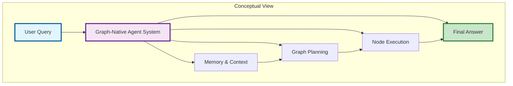
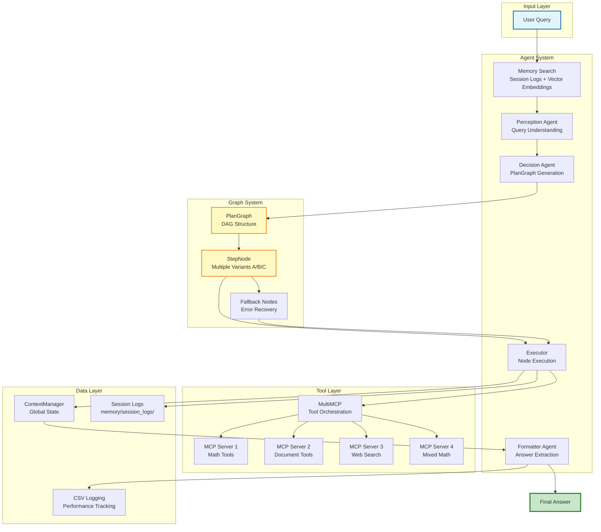

# Assignment 11 - Architecture Diagrams

## Very High Level (Conceptual)

```mermaid
graph TB
    subgraph "Conceptual View"
        User[User Query] --> System[Graph-Native Agent System]
        System --> Memory[Memory & Context]
        System --> Planning[Graph Planning]
        System --> Execution[Node Execution]
        System --> Answer[Final Answer]
        
        Memory --> Planning
        Planning --> Execution
        Execution --> Answer
    end
    
    style User fill:#e1f5ff,stroke:#01579b,stroke-width:3px
    style System fill:#f3e5f5,stroke:#6a1b9a,stroke-width:3px
    style Answer fill:#c8e6c9,stroke:#2e7d32,stroke-width:3px
```

## High Level Architecture

```mermaid
graph TB
    subgraph "Input Layer"
        Query[User Query]
    end
    
    subgraph "Agent System"
        MemorySearch[Memory Search<br/>Session Logs + Vector Embeddings]
        Perception[Perception Agent<br/>Query Understanding]
        Decision[Decision Agent<br/>PlanGraph Generation]
        Executor[Executor<br/>Node Execution]
        Formatter[Formatter Agent<br/>Answer Extraction]
    end
    
    subgraph "Graph System"
        PlanGraph[PlanGraph<br/>DAG Structure]
        StepNode[StepNode<br/>Multiple Variants A/B/C]
        Fallback[Fallback Nodes<br/>Error Recovery]
    end
    
    subgraph "Tool Layer"
        MultiMCP[MultiMCP<br/>Tool Orchestration]
        MCP1[MCP Server 1<br/>Math Tools]
        MCP2[MCP Server 2<br/>Document Tools]
        MCP3[MCP Server 3<br/>Web Search]
        MCP4[MCP Server 4<br/>Mixed Math]
    end
    
    subgraph "Data Layer"
        Context[ContextManager<br/>Global State]
        SessionLog[Session Logs<br/>memory/session_logs/]
        CSV[CSV Logging<br/>Performance Tracking]
    end
    
    Query --> MemorySearch
    MemorySearch --> Perception
    Perception --> Decision
    Decision --> PlanGraph
    PlanGraph --> StepNode
    StepNode --> Executor
    Executor --> MultiMCP
    MultiMCP --> MCP1
    MultiMCP --> MCP2
    MultiMCP --> MCP3
    MultiMCP --> MCP4
    Executor --> Context
    Context --> Formatter
    Formatter --> Answer[Final Answer]
    
    StepNode --> Fallback
    Fallback --> Executor
    
    Executor --> SessionLog
    Formatter --> CSV
    
    style Query fill:#e1f5ff,stroke:#01579b,stroke-width:2px
    style Answer fill:#c8e6c9,stroke:#2e7d32,stroke-width:3px
    style PlanGraph fill:#fff9c4,stroke:#f57f17,stroke-width:2px
    style StepNode fill:#fff9c4,stroke:#f57f17,stroke-width:2px
```

## Detailed Architecture

```mermaid
graph TB
    subgraph "1. Memory Search Layer"
        MS[MemorySearch]
        MSLoad[Load JSON Files<br/>memory/session_logs/YYYY/MM/DD/]
        MSCache[Session Caching<br/>5min TTL]
        MSFuzzy[Fuzzy Matching<br/>rapidfuzz]
        MSVector[Vector Embeddings<br/>FAISS Search]
        MSIndex[Question Word Index<br/>what/who/where/when/why/how]
        
        MS --> MSLoad
        MS --> MSCache
        MS --> MSFuzzy
        MS --> MSVector
        MS --> MSIndex
    end
    
    subgraph "2. Perception Layer"
        P[Perception Agent]
        PRoot[perceive_root<br/>Query + Memory Context]
        PStep[perceive_step_output<br/>Step Result Analysis]
        PLLM[LLM Call<br/>Gemini/Ollama]
        PResult[PerceptionResult<br/>route, goal_met, instruction]
        
        P --> PRoot
        P --> PStep
        PRoot --> PLLM
        PStep --> PLLM
        PLLM --> PResult
    end
    
    subgraph "3. Decision Layer"
        D[Decision Agent]
        DBuild[build_initial_plan_graph]
        DSelect[select_next_node]
        DFallback[add_fallback_node]
        DCode[Generate Code Variants<br/>A, B, C]
        DLLM[LLM Call<br/>Plan + Code Generation]
        
        D --> DBuild
        D --> DSelect
        D --> DFallback
        DBuild --> DLLM
        DLLM --> DCode
    end
    
    subgraph "4. Graph System"
        PG[PlanGraph<br/>DAG Structure]
        SN[StepNode<br/>index, description, variants]
        CV[CodeVariant<br/>name, source, retries]
        SS[StepStatus<br/>PENDING/COMPLETED/FAILED/SKIPPED]
        Edges[Graph Edges<br/>parent-child relationships]
        
        PG --> SN
        SN --> CV
        SN --> SS
        PG --> Edges
    end
    
    subgraph "5. Execution Layer"
        E[Executor]
        EVariant[Try Variants<br/>A → B → C]
        EAST[AST Transformations<br/>KeywordStripper<br/>AwaitTransformer<br/>IntLiteralTransformer]
        ESandbox[Code Sandbox<br/>Safe Execution]
        ERetry[Retry Logic<br/>MAX_RETRIES=3]
        EHIL[Human-in-Loop<br/>Tool Failure Recovery]
        
        E --> EVariant
        EVariant --> EAST
        EAST --> ESandbox
        ESandbox --> ERetry
        ERetry --> EHIL
    end
    
    subgraph "6. Tool Layer"
        MMCP[MultiMCP]
        MMCPInit[Initialize MCP Servers]
        MMCPCall[call_tool<br/>Route to Server]
        MMCPFunc[function_wrapper<br/>Parse Arguments]
        
        MMCP --> MMCPInit
        MMCP --> MMCPCall
        MMCPCall --> MMCPFunc
        
        subgraph "MCP Servers"
            S1[mcp_server_1.py<br/>Math: add, subtract, multiply<br/>divide, power, factorial<br/>sin, cos, tan, cbrt]
            S2[mcp_server_2.py<br/>Documents: search_stored_documents_rag<br/>convert_webpage_url_into_markdown<br/>extract_pdf]
            S3[mcp_server_3.py<br/>Web: duckduckgo_search_results<br/>duckduckgo_search_with_markdown<br/>download_raw_html_from_url]
            S4[mcp_server_4.py<br/>Mixed: add, subtract<br/>multiply, divide]
        end
        
        MMCPCall --> S1
        MMCPCall --> S2
        MMCPCall --> S3
        MMCPCall --> S4
    end
    
    subgraph "7. Context Management"
        CM[ContextManager]
        CMGlobals[globals_schema<br/>Global State]
        CMPlan[plan_graph<br/>Execution Graph]
        CMLog[log<br/>Execution Trace]
        
        CM --> CMGlobals
        CM --> CMPlan
        CM --> CMLog
    end
    
    subgraph "8. Formatter Layer"
        FA[FormatterAgent]
        FAExtract[Extract Concise Answer<br/>Regex Patterns]
        FANormalize[Normalize Text<br/>Handle Concatenated Words]
        FAProperty[Property Categorization<br/>BHK, Amenities]
        FAContext[Context-Aware Extraction]
        
        FA --> FAExtract
        FA --> FANormalize
        FA --> FAProperty
        FA --> FAContext
    end
    
    subgraph "9. Data Persistence"
        SL[Session Log]
        SLPath[get_store_path<br/>YYYY/MM/DD structure]
        SLEnhance[Enhanced Metadata<br/>question_type, entities, intent]
        CSV[CSV Manager]
        CSVTool[tool_performance.csv<br/>Execution Details]
        CSVQuery[query_text.csv<br/>Query Master Table]
        
        SL --> SLPath
        SL --> SLEnhance
        CSV --> CSVTool
        CSV --> CSVQuery
    end
    
    subgraph "10. Agent Loop Orchestration"
        AL[AgentLoop]
        ALRun[run Method]
        ALMemory[Memory Search]
        ALPerception[Root Perception]
        ALDecision[Build PlanGraph]
        ALExecute[Execute Graph Loop]
        ALFormat[Final Formatting]
        
        AL --> ALRun
        ALRun --> ALMemory
        ALRun --> ALPerception
        ALRun --> ALDecision
        ALRun --> ALExecute
        ALRun --> ALFormat
    end
    
    %% Flow connections
    ALMemory --> MS
    ALPerception --> P
    ALDecision --> D
    ALExecute --> PG
    ALExecute --> E
    ALFormat --> FA
    
    MS --> CMGlobals
    PResult --> CMGlobals
    PG --> CMPlan
    E --> CMGlobals
    FA --> CMGlobals
    
    E --> MMCP
    MMCP --> CMGlobals
    
    ALFormat --> SL
    ALFormat --> CSV
    
    style AL fill:#4a90e2,color:#fff,stroke-width:3px
    style PG fill:#fff9c4,stroke:#f57f17,stroke-width:2px
    style SN fill:#fff9c4,stroke:#f57f17,stroke-width:2px
    style CV fill:#fff9c4,stroke:#f57f17,stroke-width:2px
```

