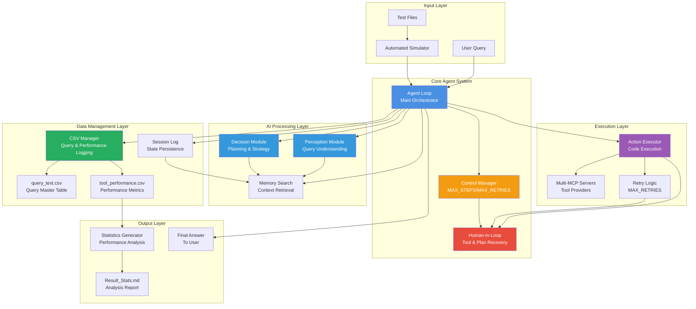
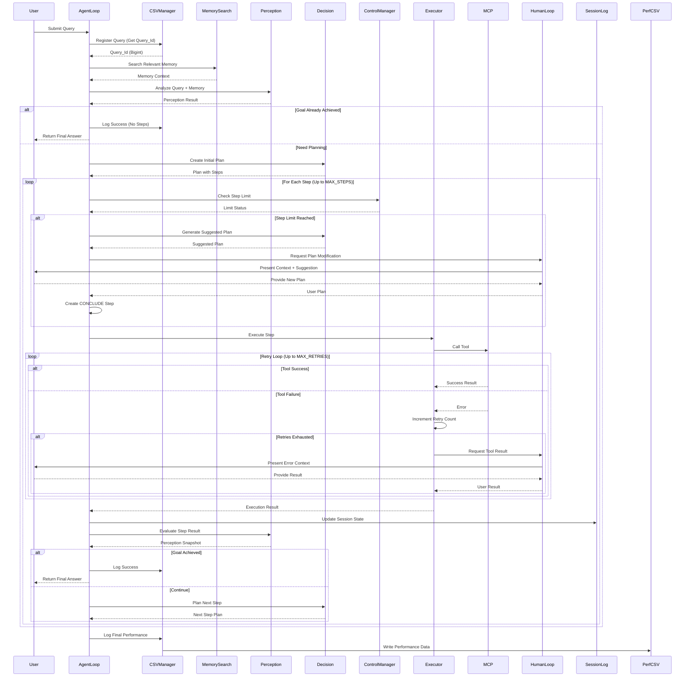
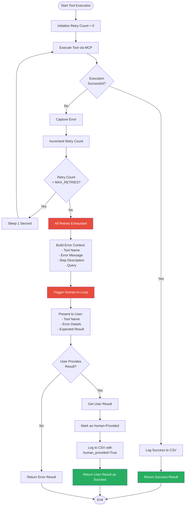
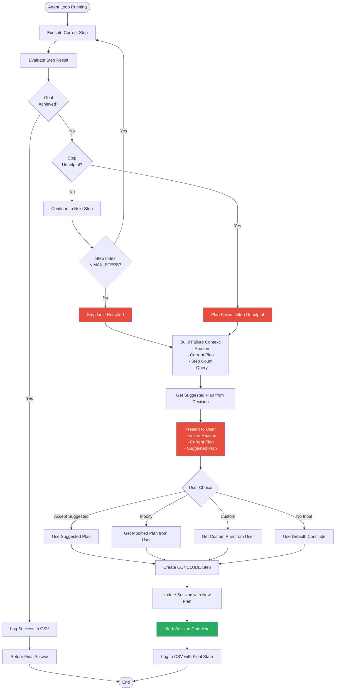
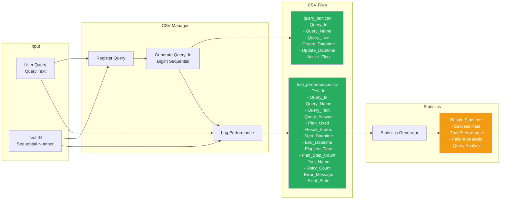
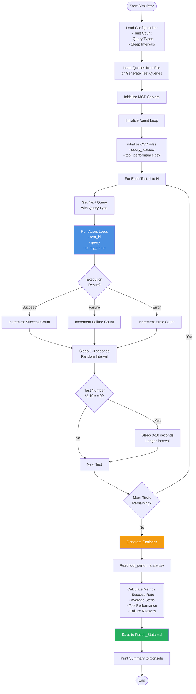
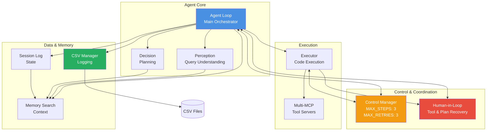
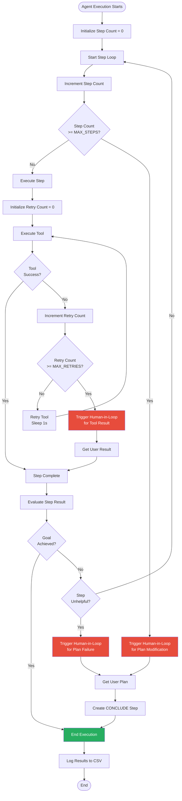

# Session 10 - Detailed Architecture and Flow Diagrams

## Complete System Architecture

## Complete Agent Loop Execution Flow

## Tool Execution with Retry and Human-in-Loop

## Plan Failure and Human-in-Loop Flow

## Data Flow and CSV Logging

## Simulator and Batch Testing Flow

## Component Interaction Matrix

## Execution Limits Enforcement

