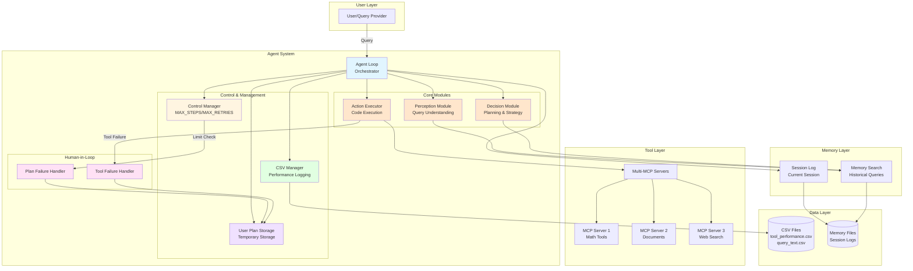
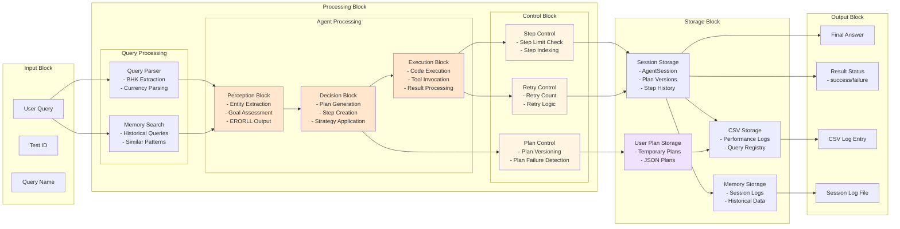
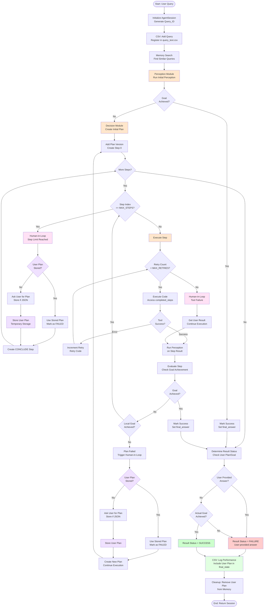
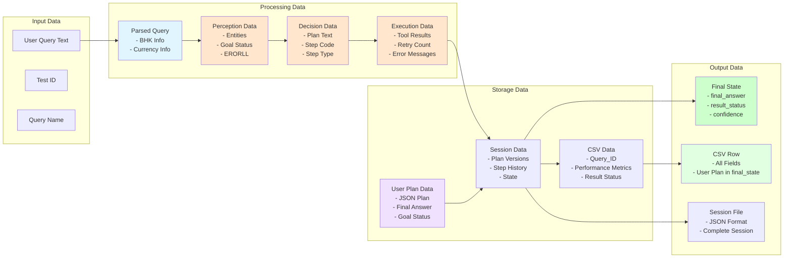
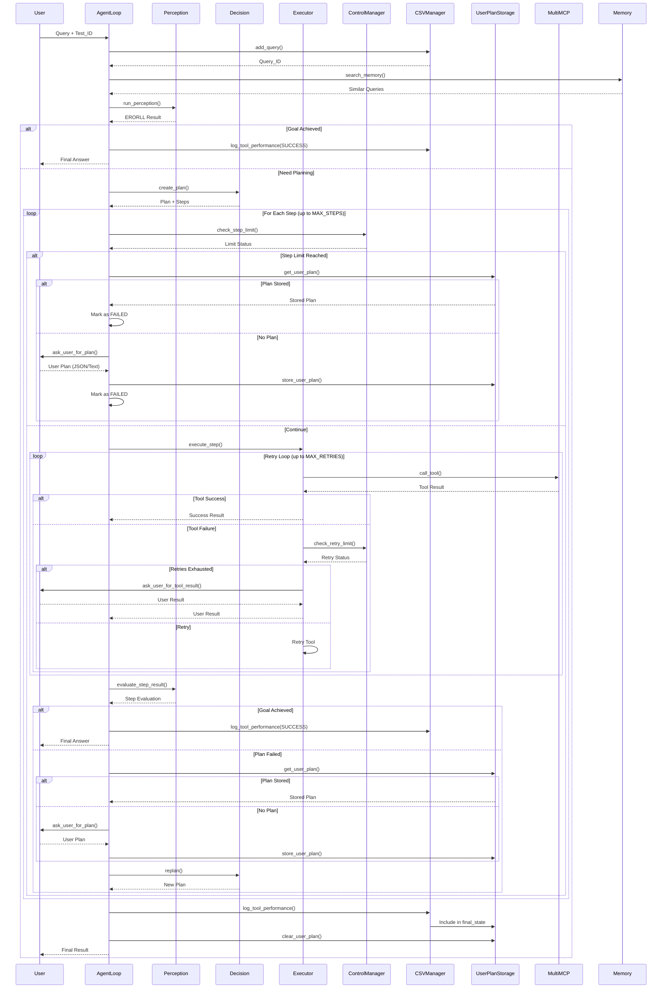
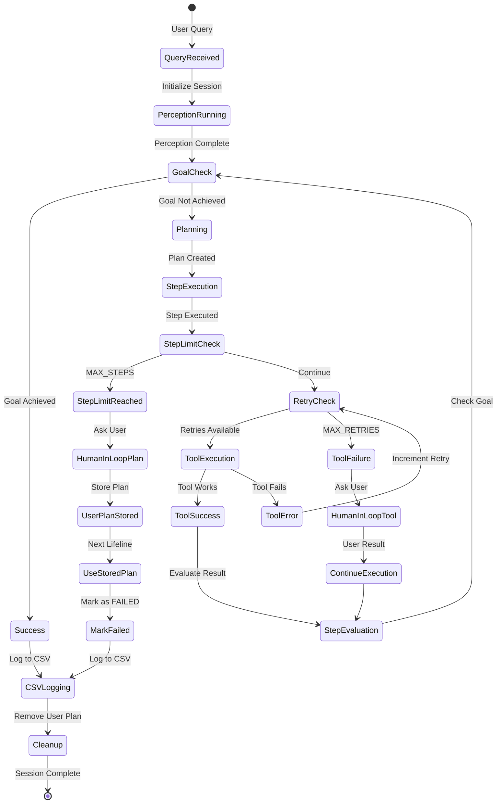

# Session 10 - Complete Architecture Diagrams

This document contains comprehensive architecture diagrams for the Multi-Agent System.
All diagrams are in Mermaid format and can be used directly in Mermaid Live Editor.

---

## 1. High-Level System Architecture



---

## 2. Detailed Component Architecture

```mermaid
graph TB
    subgraph "Agent Loop (agent_loop2.py)"
        AL[AgentLoop Class]
        ALInit[__init__<br/>- Perception<br/>- Decision<br/>- MultiMCP<br/>- ControlManager<br/>- CSVManager]
        ALRun[run Method<br/>- Query Processing<br/>- Step Execution<br/>- CSV Logging]
        ALEval[evaluate_step Method<br/>- Goal Check<br/>- Plan Failure Handling]
        ALExec[execute_step Method<br/>- Code Execution<br/>- Perception Evaluation]
    end
    
    subgraph "Perception Module (perception.py)"
        Percept[Perception Class]
        PerceptBuild[build_perception_input<br/>- Memory Integration<br/>- Context Building]
        PerceptRun[run Method<br/>- LLM Call<br/>- ERORLL Output]
    end
    
    subgraph "Decision Module (decision.py)"
        Dec[Decision Class]
        DecRun[run Method<br/>- Initial Planning<br/>- Mid-Session Planning<br/>- Plan Generation]
    end
    
    subgraph "Action Executor (executor.py)"
        Exec[run_user_code Function]
        ExecRetry[Retry Logic<br/>- MAX_RETRIES Check<br/>- Error Handling]
        ExecSandbox[Code Sandbox<br/>- Safe Execution<br/>- Tool Access<br/>- completed_steps]
        ExecHIL[Human-in-Loop<br/>- Tool Failure Handling]
    end
    
    subgraph "Control Manager (control_manager.py)"
        CM[ControlManager Class]
        CMStep[check_step_limit<br/>- MAX_STEPS Enforcement]
        CMRetry[check_retry_limit<br/>- MAX_RETRIES Enforcement]
    end
    
    subgraph "CSV Manager (csv_manager.py)"
        CSV[CSVManager Class]
        CSVAdd[add_query<br/>- Query Registration]
        CSVLog[log_tool_performance<br/>- Performance Logging]
    end
    
    subgraph "User Plan Storage (user_plan_storage.py)"
        UPS[UserPlanStorage Class]
        UPSStore[store_user_plan<br/>- Temporary Storage]
        UPSGet[get_user_plan<br/>- Plan Retrieval]
        UPSClear[clear_user_plan<br/>- Memory Cleanup]
    end
    
    AL --> ALInit
    AL --> ALRun
    ALRun --> ALEval
    ALRun --> ALExec
    
    ALRun --> Percept
    ALRun --> Dec
    ALExec --> Exec
    
    ALEval --> CM
    ALExec --> CM
    ALRun --> CSV
    ALEval --> UPS
    
    Percept --> PerceptBuild
    Percept --> PerceptRun
    
    Dec --> DecRun
    
    Exec --> ExecRetry
    Exec --> ExecSandbox
    Exec --> ExecHIL
    
    CM --> CMStep
    CM --> CMRetry
    
    CSV --> CSVAdd
    CSV --> CSVLog
    
    UPS --> UPSStore
    UPS --> UPSGet
    UPS --> UPSClear
    
    style AL fill:#e1f5ff
    style Percept fill:#ffe6cc
    style Dec fill:#ffe6cc
    style Exec fill:#ffe6cc
    style CM fill:#fff5e1
    style CSV fill:#e1ffe1
    style UPS fill:#f0e1ff
```



---

## 3. Block-Level Architecture



---

## 4. Complete Execution Flow



---

## 5. Data Flow Architecture



---

## 6. Component Interaction Sequence



---

## 7. State Management Flow



---

## Usage Instructions

1. **Copy any diagram code** (the content between ```mermaid and ```)
2. **Go to Mermaid Live Editor**: https://mermaid.live/
3. **Paste the diagram code** into the editor
4. **View and edit** the diagram as needed
5. **Export** as PNG/SVG if needed

## Diagram Descriptions

1. **High-Level System Architecture**: Overview of all major components and their relationships
2. **Detailed Component Architecture**: Internal structure of each module with methods
3. **Block-Level Architecture**: Functional blocks and data flow between them
4. **Complete Execution Flow**: Step-by-step flow of query processing
5. **Data Flow Architecture**: How data moves through the system
6. **Component Interaction Sequence**: Sequence diagram showing component interactions
7. **State Management Flow**: State transitions during execution

All diagrams are compatible with Mermaid Live Editor and can be used directly.

