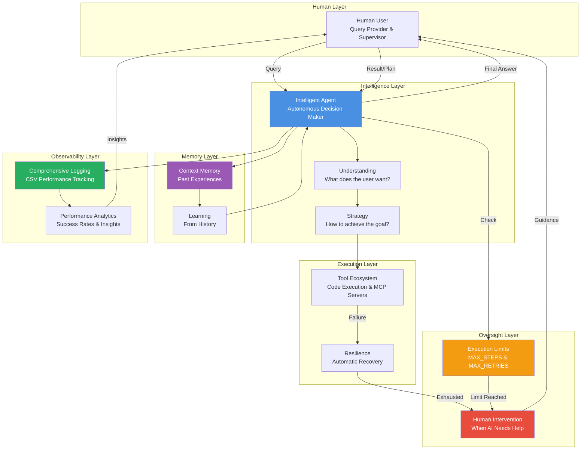
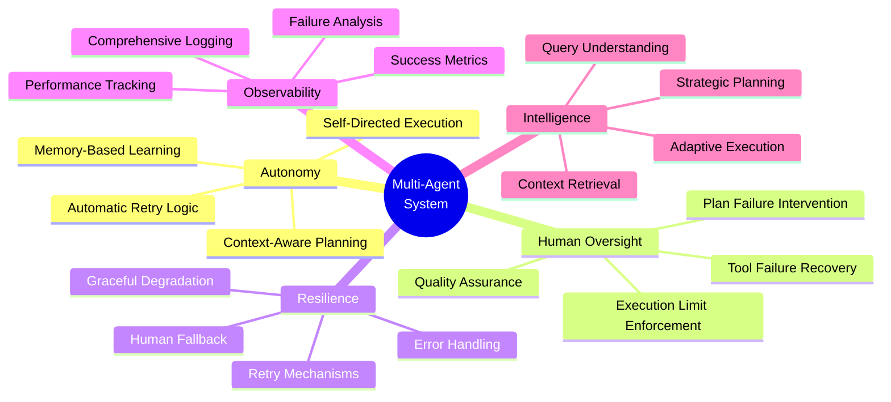
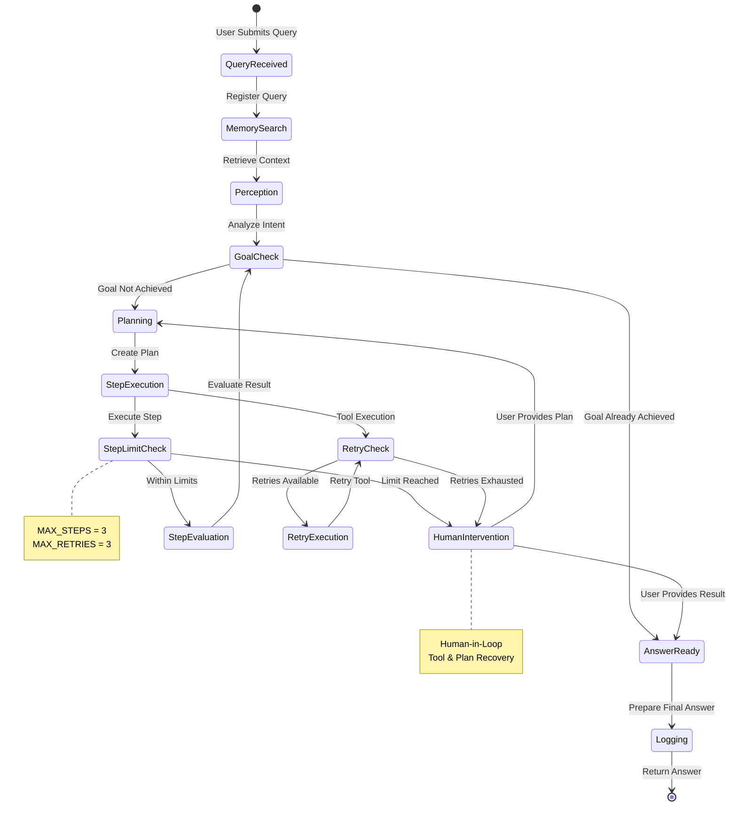
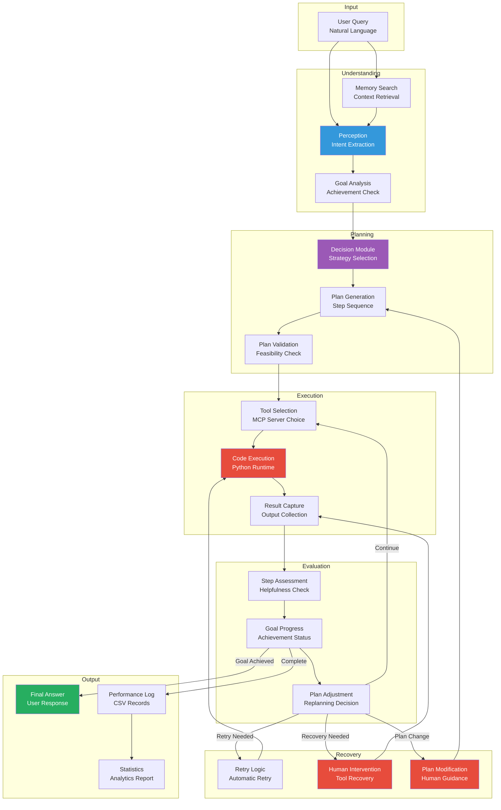
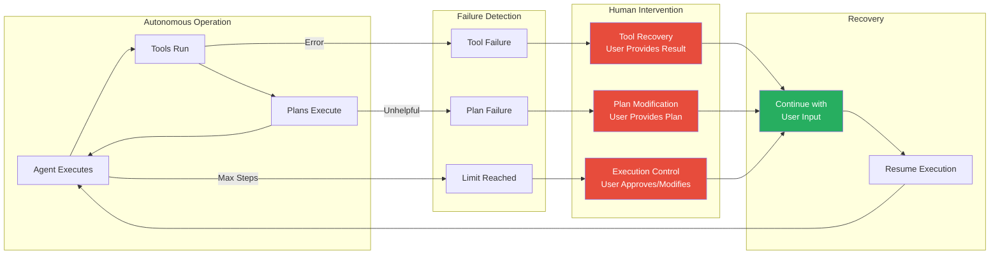
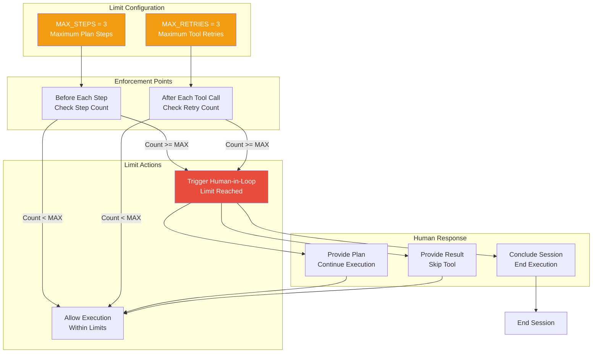
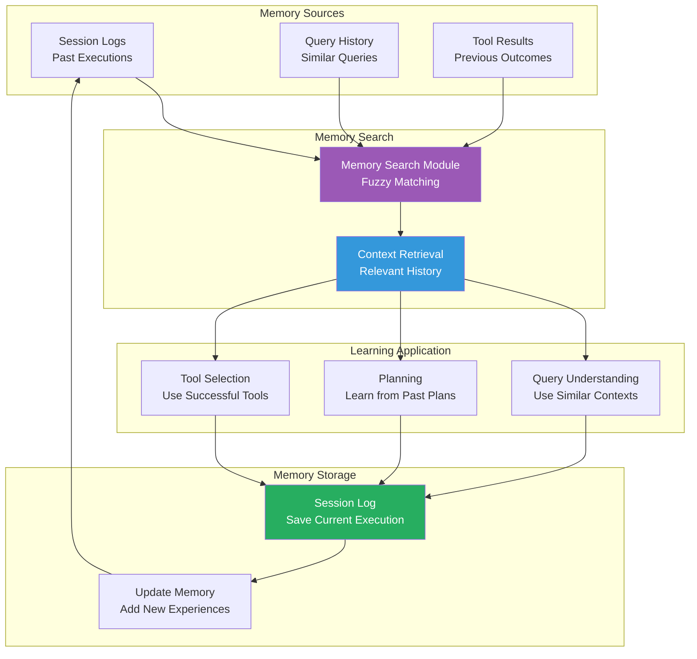
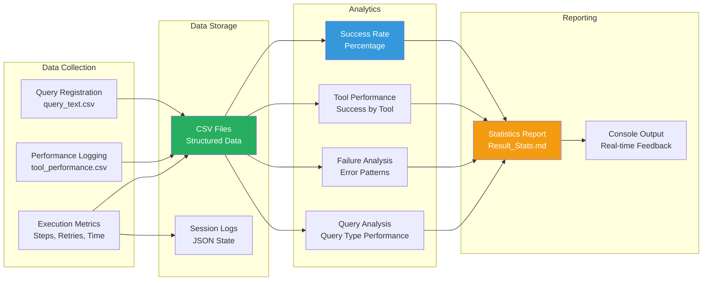
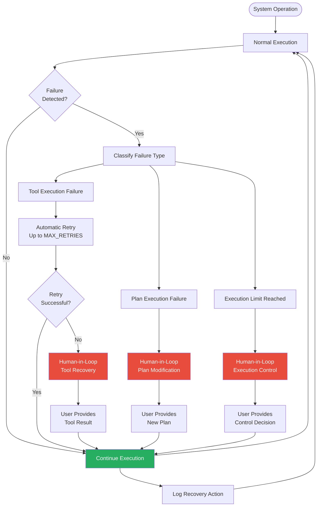
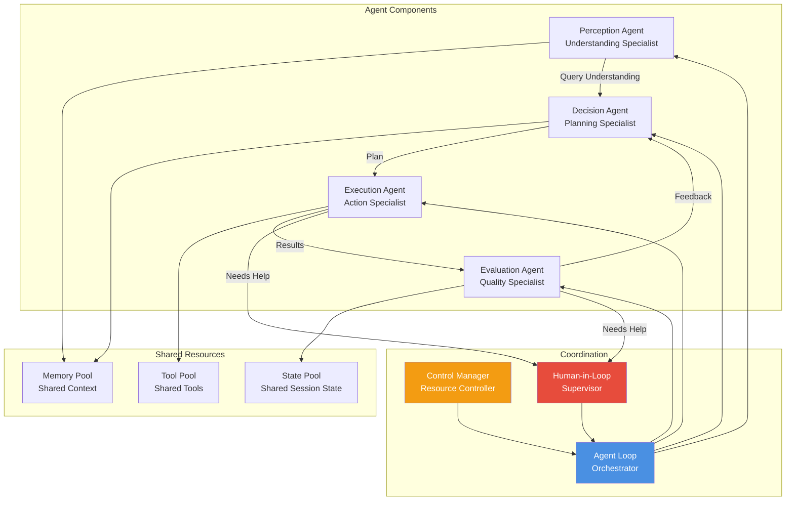

# Session 10 - High-Level Conceptual Architecture

## System Overview - Multi-Agent Coordination

## Core Principles - Autonomous with Human Oversight

## Agent Lifecycle - From Query to Answer

## Information Flow - Data Through the System

## Human-in-Loop Integration Points

## Execution Limits - Safety and Control

## Memory and Learning - Context-Aware Intelligence

## Observability and Analytics - System Intelligence

## System Resilience - Failure Recovery Strategy

## Multi-Agent Coordination Model

