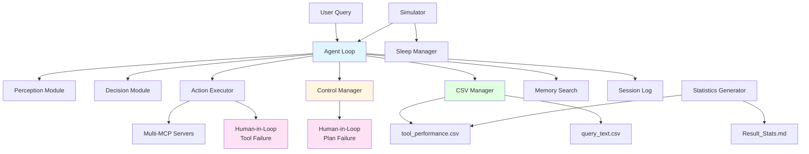
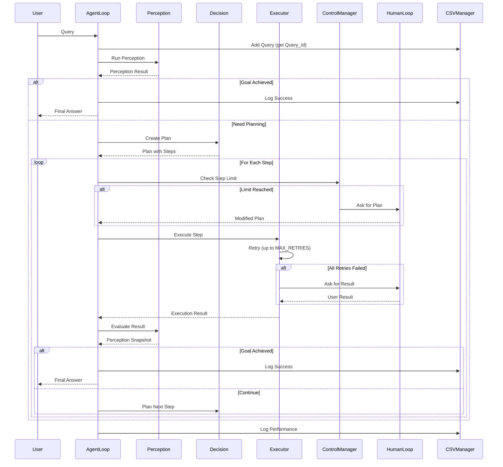
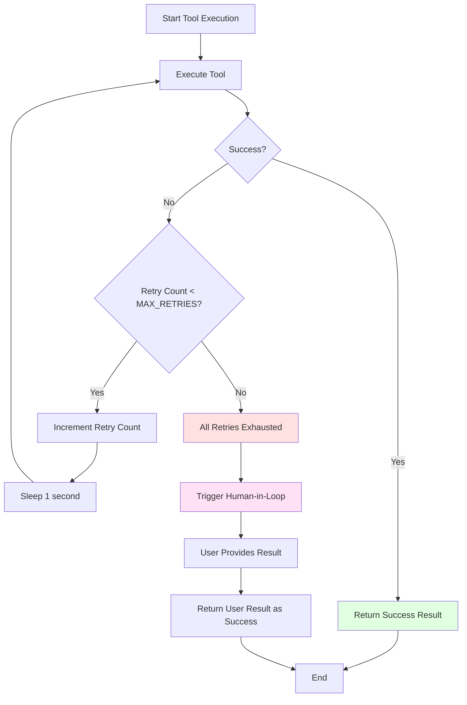
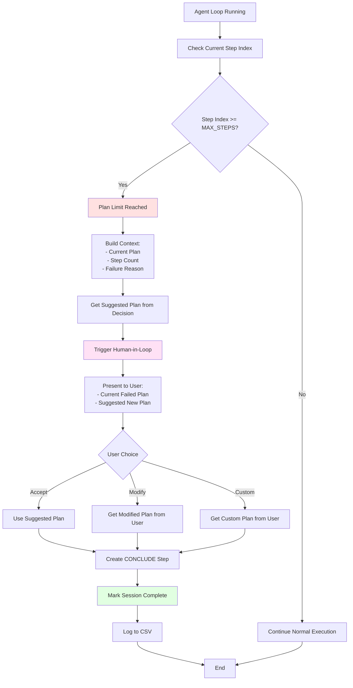
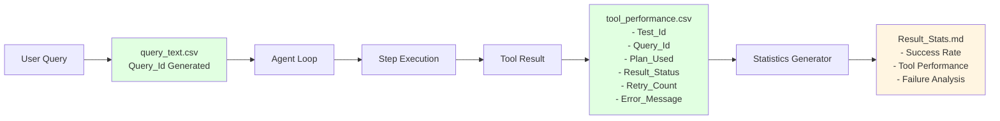
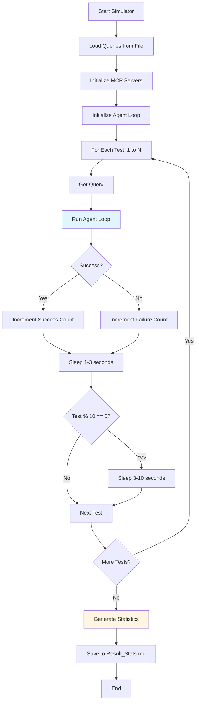
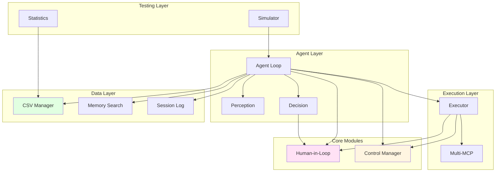

# Session 10 Architecture Diagrams

## System Architecture

## Agent Loop Flow

## Tool Failure and Retry Flow

## Plan Failure and Human-in-Loop Flow

## Data Flow Diagram

## Simulator Flow

## Component Interaction

