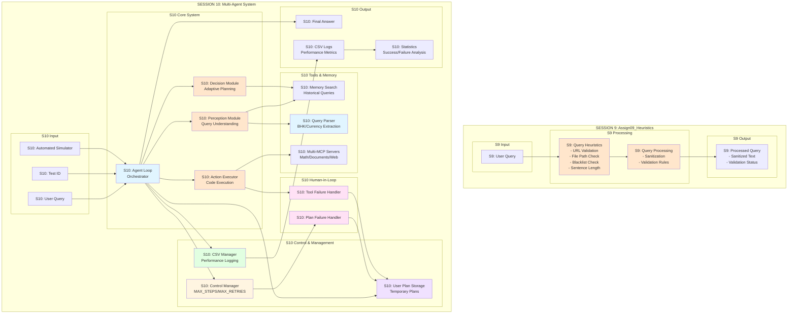
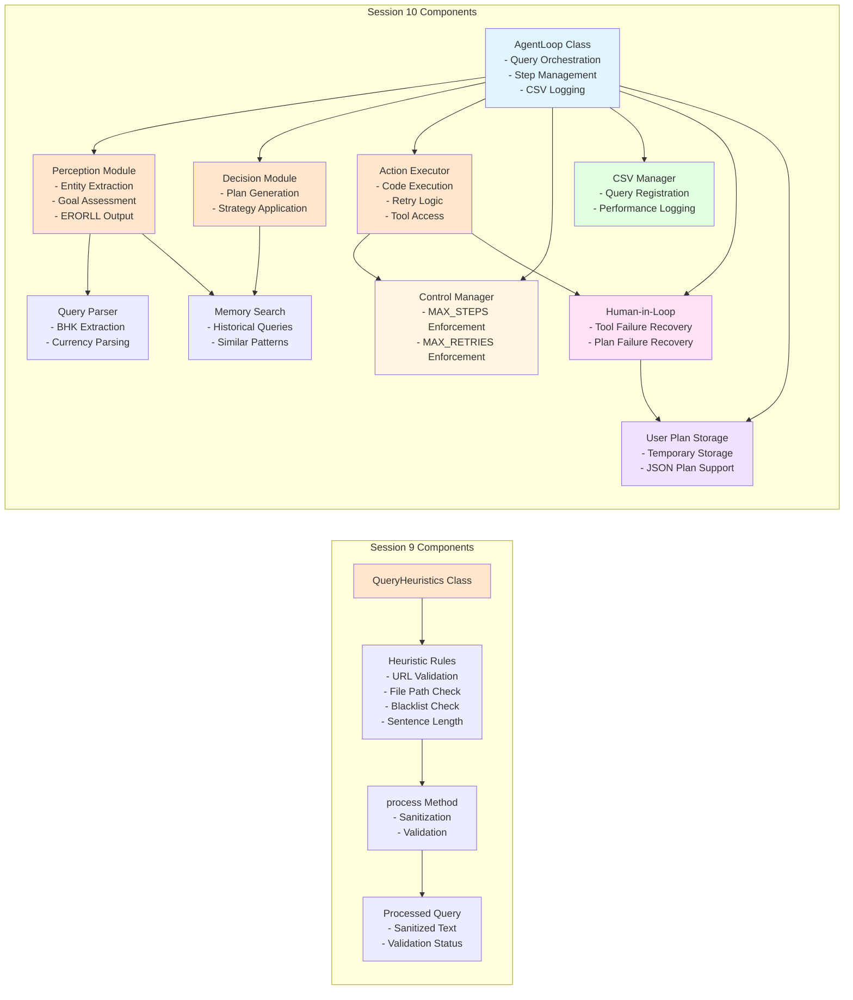
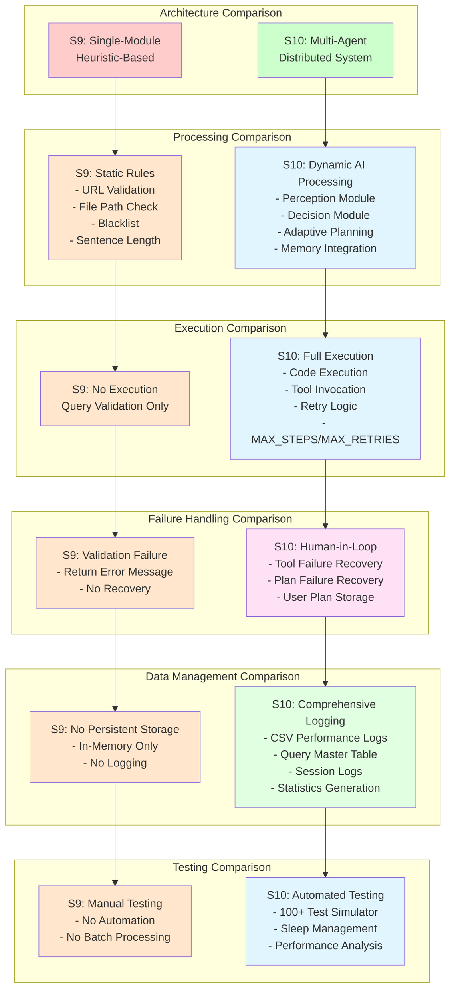
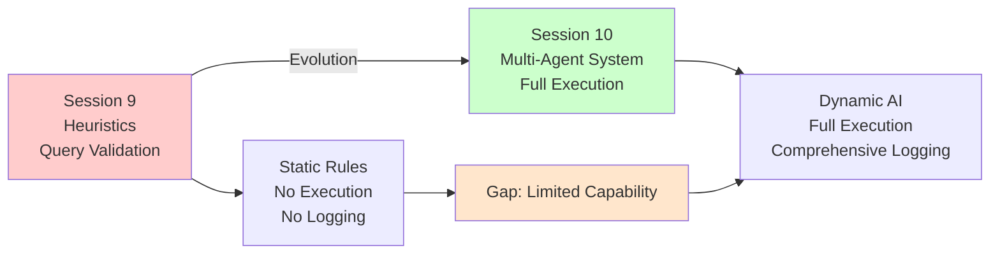
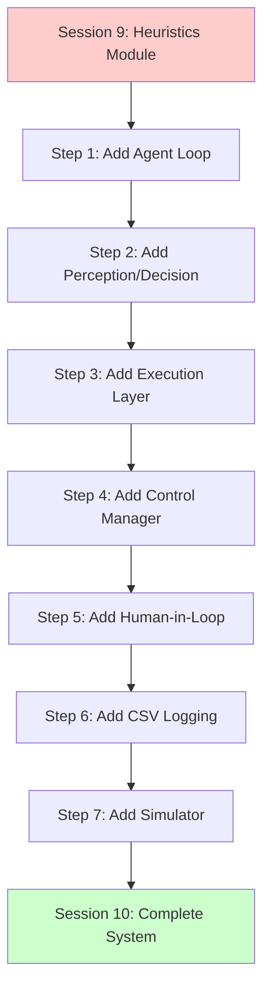

# Session 10 vs Session 9 Architecture Comparison

## High-Level Architecture Comparison

---

## Detailed Component Comparison

---

## Feature Comparison Matrix

---

## Key Differences Summary

### 1. Architecture Paradigm

**Session 9:**
- Single-module heuristic-based system
- Query validation and sanitization only
- No agent loop or execution capability

**Session 10:**
- Multi-agent distributed system
- Full agent loop with perception, decision, and execution
- Coordinated multi-module architecture

### 2. Processing Capability

**Session 9:**
- Static heuristic rules (URL, file path, blacklist, sentence length)
- Query sanitization only
- No AI/LLM integration

**Session 10:**
- Dynamic AI processing (Perception, Decision modules)
- Adaptive planning with strategy selection
- Memory integration for context
- Query parsing (BHK, currency extraction)

### 3. Execution Model

**Session 9:**
- No execution capability
- Validation and sanitization only

**Session 10:**
- Full code execution with sandbox
- Multi-tool orchestration (MCP servers)
- Retry logic with MAX_RETRIES
- Step management with MAX_STEPS

### 4. Failure Recovery

**Session 9:**
- Validation failures return error messages
- No recovery mechanism

**Session 10:**
- Human-in-loop for tool failures
- Human-in-loop for plan failures
- User plan storage for next lifeline
- Automatic retry with user intervention fallback

### 5. Data Management

**Session 9:**
- No persistent storage
- In-memory processing only
- No logging or tracking

**Session 10:**
- CSV logging (tool_performance.csv, query_text.csv)
- Session logs with JSON format
- Query master table with tracking
- Statistics generation and analysis

### 6. Testing & Automation

**Session 9:**
- Manual testing only
- No batch processing
- No performance metrics

**Session 10:**
- Automated simulator (100+ tests)
- Sleep management for API rate limiting
- Performance statistics generation
- Success/failure rate analysis

### 7. Query Understanding

**Session 9:**
- Basic validation (URLs, file paths, blacklist)
- No entity extraction
- No semantic understanding

**Session 10:**
- Entity extraction (BHK, currency, etc.)
- Semantic query understanding
- Memory-based context retrieval
- Goal assessment and planning

### 8. Control & Limits

**Session 9:**
- No execution limits
- No step management
- No retry mechanism

**Session 10:**
- MAX_STEPS = 3 enforcement
- MAX_RETRIES = 3 enforcement
- Control Manager for centralized limits
- Step and retry tracking

---

## Evolution Path

---

## Migration Path (Conceptual)

---

## Brief Explanation of Differences

### **Session 9 (Assign09_Heuristics)**
- **Purpose**: Query validation and sanitization
- **Architecture**: Single-module heuristic-based system
- **Functionality**: 
  - URL validation
  - File path checking
  - Blacklist word detection
  - Sentence length validation
  - Query sanitization
- **Limitations**: 
  - No execution capability
  - No AI/LLM integration
  - No persistent storage
  - No failure recovery
  - Manual testing only

### **Session 10 (Multi-Agent System)**
- **Purpose**: Full multi-agent system with distributed AI coordination
- **Architecture**: Multi-module distributed system with agent loop
- **Functionality**:
  - AI-powered perception and decision making
  - Full code execution with tool orchestration
  - Human-in-loop for failure recovery
  - Comprehensive CSV logging
  - Automated batch testing
  - Query parsing (BHK, currency)
  - Memory integration
  - Execution limits (MAX_STEPS, MAX_RETRIES)
- **Advancements**:
  - Dynamic AI processing vs static rules
  - Full execution capability vs validation only
  - Human-in-loop recovery vs no recovery
  - Comprehensive logging vs no logging
  - Automated testing vs manual testing
  - Multi-tool orchestration vs single module

### **Key Architectural Shift**
Session 9 was a **validation layer** - it checked and sanitized queries but didn't execute them. Session 10 is a **complete agent system** - it understands queries, plans solutions, executes code, handles failures, and logs everything for analysis.

---

## Files for Mermaid Live

All diagrams above can be copied directly into Mermaid Live Editor (https://mermaid.live/). Each diagram is self-contained and includes all necessary Mermaid syntax.

