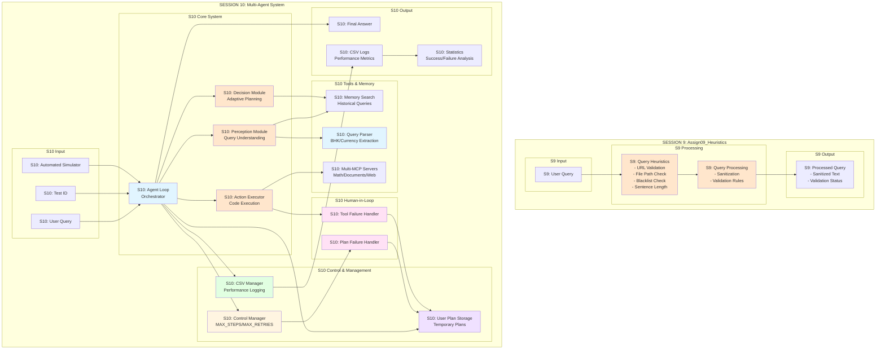
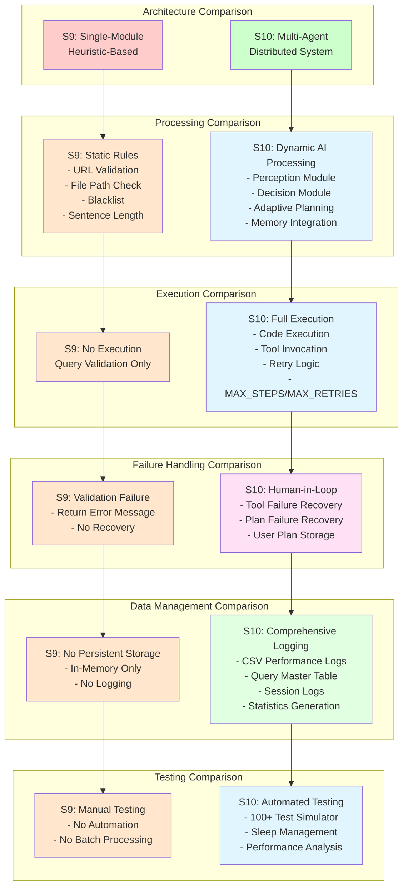
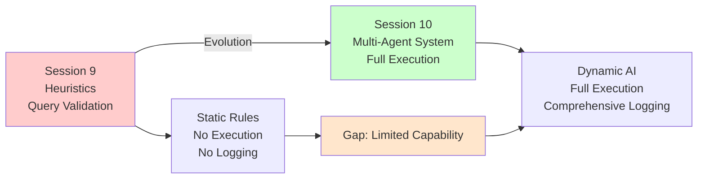

# Session 10 vs Session 9 Architecture Comparison

This file contains Mermaid diagrams that can be viewed directly in VS Code/Cursor with Mermaid extensions.

---

## 1. High-Level Architecture Comparison

---

## 2. Feature Comparison Matrix

---

## 3. Evolution Path

---

## How to View in VS Code/Cursor

### Option 1: Markdown Preview Mermaid Support (Recommended)

1. **Install Extension**:
   - Press `Ctrl+Shift+X` (or `Cmd+Shift+X` on Mac)
   - Search: `Markdown Preview Mermaid Support`
   - Author: **Matt Bierner**
   - Click **Install**

2. **View Diagram**:
   - Open this `.md` file
   - Press `Ctrl+Shift+V` (or `Cmd+Shift+V` on Mac) to open preview
   - Diagrams will render automatically

### Option 2: Mermaid Preview Extension

1. **Install Extension**:
   - Search: `Mermaid Preview`
   - Author: **vstirbu**
   - Click **Install**

2. **View Diagram**:
   - Open this `.md` file
   - Press `Ctrl+Shift+P` (or `Cmd+Shift+P` on Mac)
   - Type: `Mermaid: Preview`
   - Select the command

### Option 3: View Raw Text File

For `S10_vs_S09_comparison_raw.txt`:
- The raw text file contains Mermaid code without markdown wrappers
- You can copy individual diagram code blocks
- Paste into Mermaid Live Editor: https://mermaid.live/
- Or use a Mermaid extension that supports `.txt` files

---

## Key Differences Summary

### Session 9 (Assign09_Heuristics)
- **Architecture**: Single-module heuristic-based system
- **Functionality**: Query validation and sanitization only
- **Processing**: Static rules (URL, file path, blacklist, sentence length)
- **Execution**: No execution capability
- **Storage**: No persistent storage
- **Testing**: Manual testing only

### Session 10 (Multi-Agent System)
- **Architecture**: Multi-agent distributed system
- **Functionality**: Full agent loop with AI processing
- **Processing**: Dynamic AI (Perception, Decision, Memory)
- **Execution**: Code execution with tool orchestration
- **Storage**: CSV logging, session logs, statistics
- **Testing**: Automated batch testing (100+ tests)

### Major Improvements
1. **From Static to Dynamic**: Heuristic rules → AI-powered processing
2. **From Validation to Execution**: Query checking → Full code execution
3. **From No Recovery to Human-in-Loop**: Error messages → Interactive recovery
4. **From No Logging to Comprehensive**: In-memory → CSV + Statistics
5. **From Manual to Automated**: Single tests → Batch simulator

