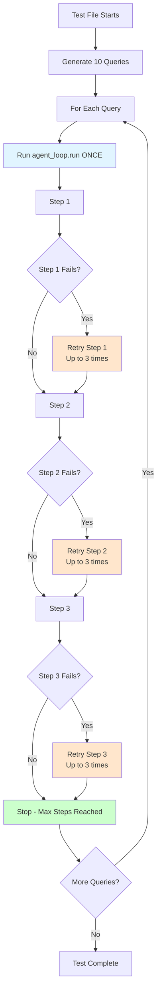

# Loop Logic Explanation

## Understanding the Configuration

### From `config/profiles.yaml`:

```yaml
max_steps: 3                  # max sequential agent steps
max_lifelines_per_step: 3      # retries for each step (after primary failure)
```

## What These Mean

### `max_steps: 3`
- **NOT**: "Run the query 3 times"
- **YES**: "Maximum 3 steps per query execution"
- **Example**: 
  - Query: "Find 3BHK apartments"
  - Step 1: Search properties
  - Step 2: Filter by BHK
  - Step 3: Filter by price
  - **STOPS HERE** (max_steps reached)
  - Query runs **ONCE**, but executes **3 steps**

### `max_lifelines_per_step: 3`
- **NOT**: "Run each step 3 times"
- **YES**: "Retry each step up to 3 times if it fails"
- **Example**:
  - Step 1: Tool execution fails
  - Retry 1: Tool execution fails
  - Retry 2: Tool execution fails
  - Retry 3: Tool execution fails
  - **STOPS** (max_lifelines_per_step reached)
  - Step runs **ONCE** (with 3 retries on failure)

## Test Execution Flow

```
Tests/my_test_10.py
├── Generate 10 queries
├── For each query (loop 10 times):
│   ├── Run agent_loop.run(query) ← RUNS ONCE PER QUERY
│   ├── Inside agent_loop.run():
│   │   ├── Step 1 (can retry up to 3 times if fails)
│   │   ├── Step 2 (can retry up to 3 times if fails)
│   │   └── Step 3 (can retry up to 3 times if fails)
│   │   └── STOP (max_steps = 3 reached)
│   └── Log result
└── Print summary
```

## Visual Flow



## Key Points

1. **Each query runs ONCE** - `agent_loop.run(query)` is called once per query
2. **Each query can have up to 3 steps** - Limited by `max_steps: 3`
3. **Each step can retry up to 3 times** - Limited by `max_lifelines_per_step: 3`
4. **Test file runs 10 queries** - One after another, each once

## If You See "3 Times"

If you're seeing something run "3 times", it's likely:

1. **3 Steps per Query** (correct behavior)
   - Query executes step 1, step 2, step 3
   - This is `max_steps: 3` working correctly

2. **3 Retries per Step** (correct behavior)
   - Step fails, retries 3 times
   - This is `max_lifelines_per_step: 3` working correctly

3. **NOT 3 Query Executions** (incorrect if happening)
   - Each query should run only once
   - If this is happening, there's a bug

## Verification

To verify the test runs once per query, check:
1. `agent_loop.run()` is called once per query in the loop
2. No nested loops calling `agent_loop.run()` multiple times
3. CSV logs show one entry per query (not 3)

