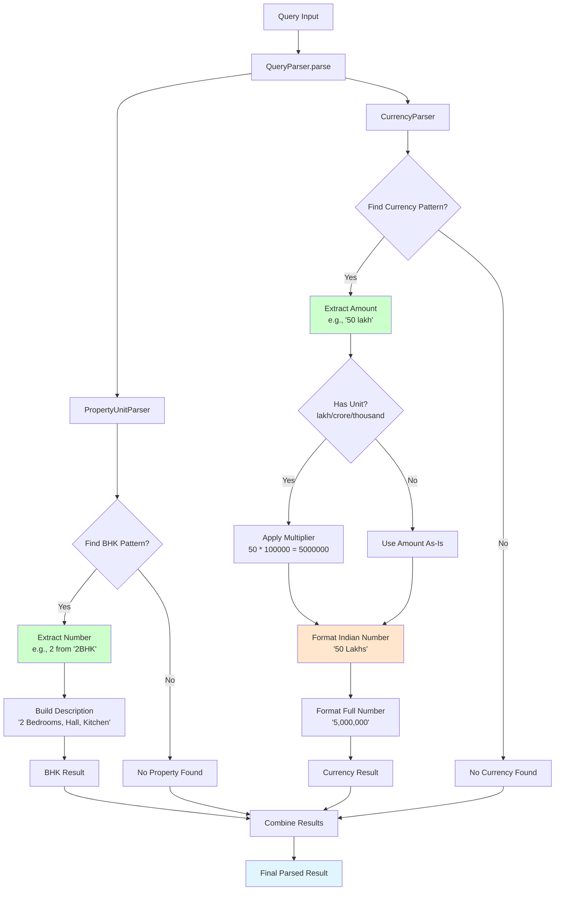
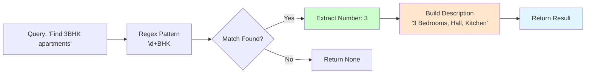
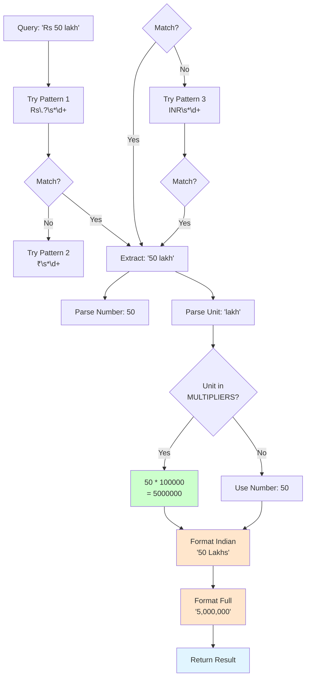
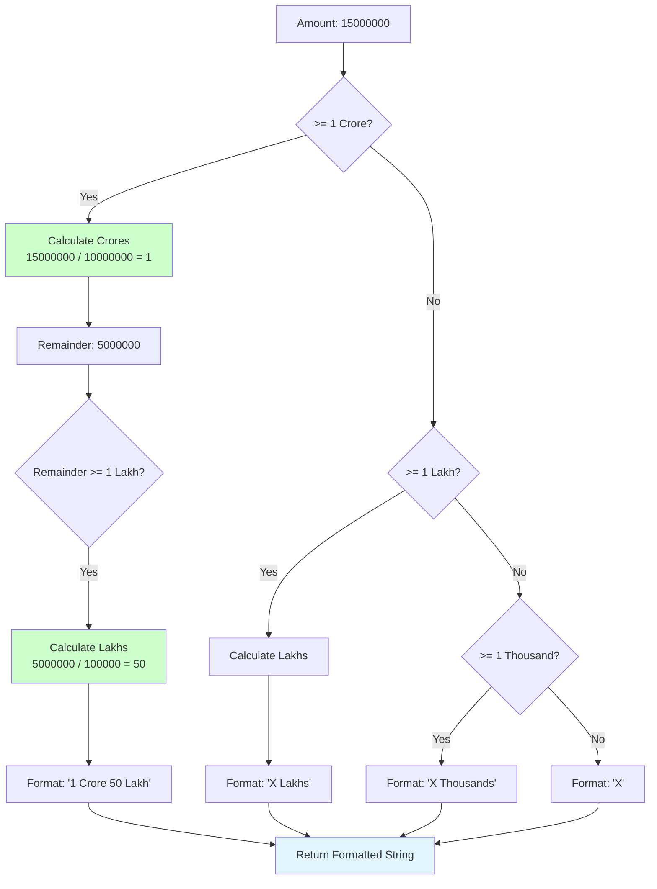
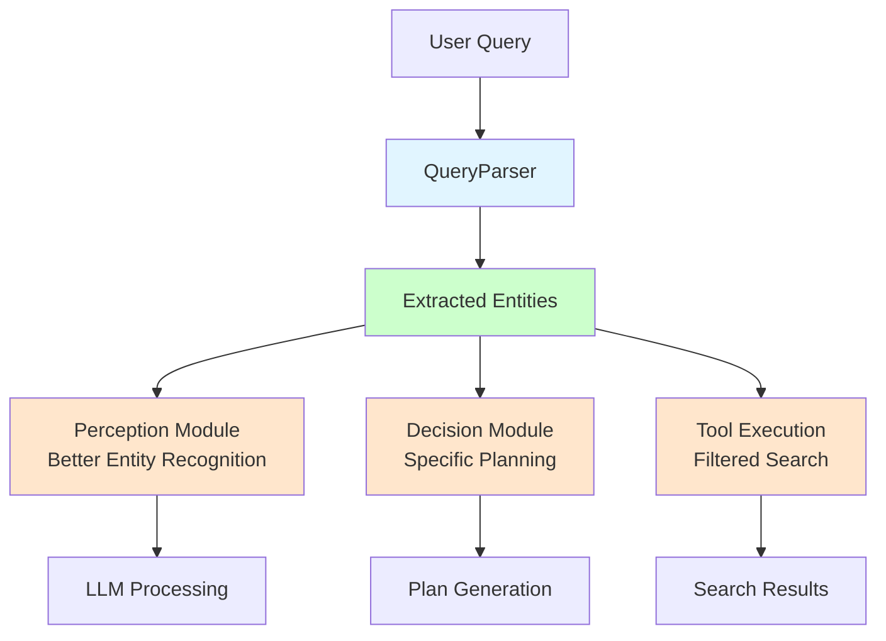

# Query Parser Logic Flow Diagram

## Overall Flow



## Property Unit Parsing (BHK)



## Currency Parsing (Rs/INR)



## Indian Number Formatting Logic



## Example: Combined Parsing

```mermaid
sequenceDiagram
    participant Query as Query Input
    participant Parser as QueryParser
    participant Prop as PropertyUnitParser
    participant Curr as CurrencyParser
    participant Result as Final Result
    
    Query->>Parser: "Find 3BHK costing Rs 50 lakh"
    Parser->>Prop: parse_bhk(query)
    Prop->>Prop: Match pattern "3BHK"
    Prop->>Prop: Extract: bedrooms=3
    Prop->>Prop: Build: "3 Bedrooms, Hall, Kitchen"
    Prop-->>Parser: {bedrooms: 3, ...}
    
    Parser->>Curr: parse_currency(query)
    Curr->>Curr: Match pattern "Rs 50 lakh"
    Curr->>Curr: Extract: amount=50, unit="lakh"
    Curr->>Curr: Calculate: 50 * 100000 = 5000000
    Curr->>Curr: Format: "50 Lakhs" / "5,000,000"
    Curr-->>Parser: {amount: 5000000, ...}
    
    Parser->>Parser: Combine results
    Parser-->>Result: {
        has_property: true,
        has_currency: true,
        property: {...},
        currency: {...}
    }
```

## Integration Points



