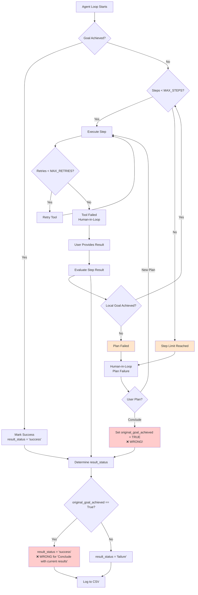
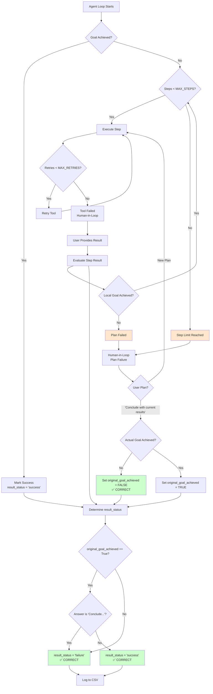

# Result Status Logic Flow

## Current Flow (BEFORE FIX)



## Problem

1. **Step Limit Reached**: When MAX_STEPS is reached, code sets `original_goal_achieved=True` (line 103) even though goal wasn't achieved
2. **Plan Failed**: When plan fails and user provides "Conclude with current results", it's marked as success
3. **Result Status**: Always checks `original_goal_achieved` but doesn't check if we're concluding due to failure

## Fixed Flow (AFTER FIX)



## Key Changes

1. **Detect Conclusion Due to Failure**: Check if final answer contains "Conclude with current results" or similar
2. **Don't Set Goal Achieved on Limit**: When step limit is reached, only set `original_goal_achieved=True` if goal was actually achieved
3. **Check Answer Content**: Even if `original_goal_achieved=True`, check if answer indicates failure
4. **Proper Status**: Mark as "failure" when concluding due to limits/failures

## Decision Logic

```python
# Pseudo-code for fixed logic
if original_goal_achieved == True:
    # Check if we're concluding due to failure
    if final_answer contains "Conclude with current results":
        result_status = "failure"  # Didn't actually achieve goal
    else:
        result_status = "success"  # Actually achieved goal
else:
    result_status = "failure"  # Goal not achieved
```

