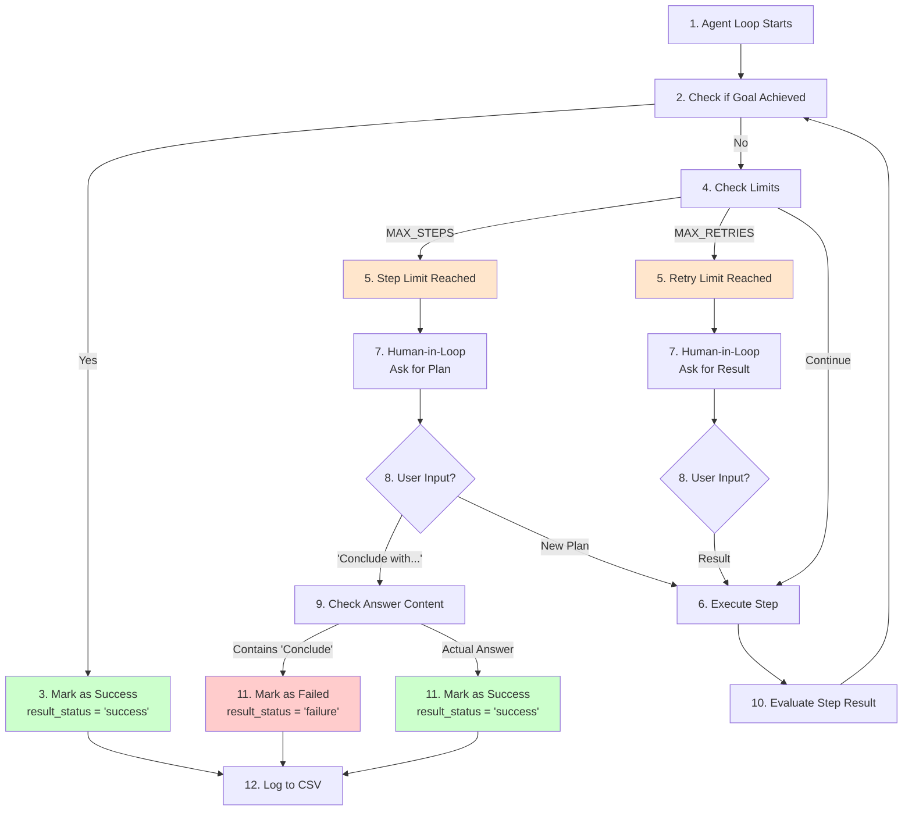

# Result Status Logic - Steps Overview (Brief)

## Key Steps Involved



## Decision Points

### Step 9: Check Answer Content (NEW LOGIC)

```python
if answer contains "Conclude with current results":
    → result_status = "failure"  # Didn't achieve goal
else:
    → result_status = "success"  # Actually achieved goal
```

## Three Scenarios

### Scenario A: Goal Actually Achieved
```
1. Execute steps
2. Goal achieved = True
3. Final answer = "The result is 42"
4. Result Status = "success" ✅
```

### Scenario B: Step Limit Reached, Concluding
```
1. Execute steps
2. MAX_STEPS reached
3. User: "Conclude with current results"
4. Goal achieved = False (FIXED)
5. Final answer = "Conclude with current results"
6. Result Status = "failure" ✅
```

### Scenario C: Retry Limit Reached, Tool Failed
```
1. Execute step
2. Tool fails
3. MAX_RETRIES reached
4. User provides result (or default)
5. Goal achieved = False
6. Result Status = "failure" ✅
```

## Files Modified

1. **agent/agent_loop2.py**
   - Step limit handling (lines 90-112)
   - Result status determination (lines 125-137)
   - evaluate_step method (lines 321-350)

2. **Tests/my_test_100.py**
   - CSV logging logic (line 373)

## Result

✅ Queries ending with "Conclude with current results" → `result_status = "failure"`  
✅ Queries actually achieving goal → `result_status = "success"`  
✅ Accurate statistics in `tool_performance.csv`

